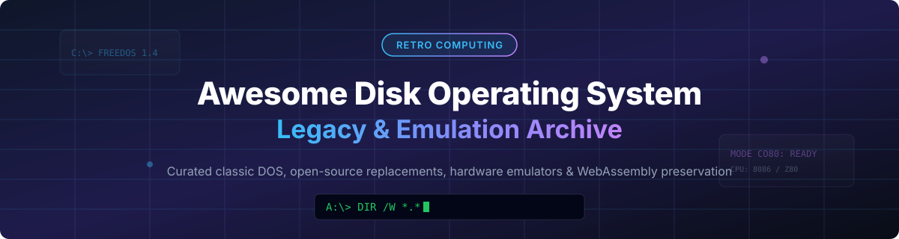

  

# 💾 Awesome Legacy Disk Operating Systems & Open-Source Emulators 🚀

  
  
  

> 🕹️ A curated list of classic legacy disk operating systems (DOS), open-source replacements, hardware-accurate emulators, and WebAssembly preservation tools.

---

## 🔍 Overview & SEO Keywords 📌

This repository serves as a comprehensive directory for **legacy disk operating systems**, classic PC retro-computing platforms, and modern open-source DOS reimplementations. Whether you are looking for **MS-DOS preservation**, **CP/M emulators**, **FreeDOS installation guide sources**, **Apple DOS emulators**, or **x86 browser virtualization (WebAssembly / Wasm)**, this list tracks active projects, emulators, and historical source releases.

### 🎯 Key Topics Covered:
- 💾 **Classic Disk Operating Systems**: MS-DOS, IBM PC DOS, DR-DOS, Apple DOS, ProDOS, CP/M, Commodore DOS, Atari DOS, PTS-DOS.
- 🔓 **Open-Source DOS Replacements & Emulators**: FreeDOS, DOSBox-X, 86Box, v86, DOS Wasm X, RunCPM, AppleWin, VICE.
- ⚡ **Retro Computing & Preservation**: WebAssembly browser emulation, x86 hardware accuracy, industrial DOS control software, vintage floppy disk imaging.

---

## 📖 Table of Contents 📑

- [💾 Legacy Disk Operating Systems](#-legacy-disk-operating-systems)
- [🔓 Open-Source Alternatives & Emulators](#-open-source-alternatives--emulators)
- [🤝 How to Contribute](#-how-to-contribute)
- [💖 Support](#-support)
- [📈 Star History](#-star-history)
- [⚠️ Disclaimer](#%EF%B8%8F-disclaimer)

## 💾 Legacy Disk Operating Systems 🖥️

> **📊 Market Context**: The legacy DOS market is **not a commercial market** — these operating systems are **abandoned, unsupported, and largely unavailable for purchase**. The value lies in **historical preservation, retro gaming, embedded systems, and industrial control**. DOS remains surprisingly relevant in 2026: **industrial machines, cash registers, and specialized hardware** still rely on DOS-based control software that cannot easily be modernized. **FreeDOS** has become the de-facto open-source replacement, and DOS emulation has matured to the point where classic software runs identically on modern hardware. The ecosystem is **highly fragmented** — each legacy DOS has its own preservation community, emulator, and compatibility challenges.

| Operating System | Description | Release Era | Current Status | Preservation Path |
|-----------------|-------------|-------------|----------------|-------------------|
| **[MS-DOS](https://en.wikipedia.org/wiki/MS-DOS)** | **The foundation of PC computing.** Command-line interface, FAT filesystem, and the platform that launched a thousand games. Final standalone version: 6.22 (1994). Last embedded release: 8.0 in Windows ME (2000) . | **1981–2000** | **Discontinued** — Microsoft ended support in 2001. **MS-DOS 4.00 source code released under MIT License** (April 2024) . | **FreeDOS** (open-source replacement) , **DOSBox-X** (emulation) , **86Box** (hardware-accurate) , **v86** (browser) . |
| **[PC DOS](https://en.wikipedia.org/wiki/IBM_PC_DOS)** | **IBM's OEM version of MS-DOS.** Shipped with IBM PCs and PS/2 systems. **PC DOS 2000** (1998) was the final release, incorporating Y2K fixes . | **1981–2000** | **Discontinued** — IBM ended support. | **DOSBox-X** , **86Box** , **VirtualBox** (for PC DOS 2000) . |
| **[FreeDOS](https://www.freedos.org/)** | **The fully open-source MS-DOS replacement.** **1.4** (2025) is the latest release. Runs classic DOS games and business software. Includes kernel, FreeCOM command shell, and utilities . | **1994–present** | **Actively developed** — 1.4 released 2025. | **Native installation** — runs on real hardware and VMs. **DOSBox-X** and **QEMU** for emulation . |
| **[DR-DOS](https://en.wikipedia.org/wiki/DR-DOS)** | **Digital Research's MS-DOS competitor.** Superior memory management and multitasking in some versions. **DR-DOS 7.01** released as freeware for non-commercial use . | **1988–2002** | **Discontinued** (commercial); **DR-DOS 7.01.08** available as freeware for personal use . | **DOSBox-X** , **86Box** , **VirtualBox** . |
| **[Apple DOS](https://en.wikipedia.org/wiki/Apple_DOS)** | **Apple II disk operating system.** **Apple DOS 3.3** (1980) was the definitive version, supporting 140KB floppy disks . | **1978–1983** | **Discontinued** — superseded by ProDOS. | **AppleWin** (Windows emulator) , **MAME** , **Virtual ][** (macOS) . |
| **[ProDOS](https://en.wikipedia.org/wiki/Apple_ProDOS)** | **Apple II's advanced DOS.** Hierarchical file system, supports hard drives and larger volumes. **ProDOS 2.4** (2016) is a modern community update with bug fixes and new features . | **1983–1993** | **Discontinued** — community updates continue. | **AppleWin** , **MAME** , **Virtual ][** . |
| **[Commodore DOS](https://en.wikipedia.org/wiki/Commodore_DOS)** | **Commodore's disk operating system for 8-bit computers.** Used on C64, VIC-20, and PET. **CBM DOS 2.6** was the most common version . | **1977–1990s** | **Discontinued**. | **VICE** (Versatile Commodore Emulator) , **CCS64** , **Hoxs64** . |
| **[CP/M](https://en.wikipedia.org/wiki/CP/M)** | **The first widely adopted microcomputer OS.** Gary Kildall's Control Program for Microcomputers. The platform that inspired MS-DOS . | **1974–1980s** | **Discontinued** — but **CP/M source code released under BSD-like license** (2001, Lineo) . | **z80pack** , **tnylpo** , **RunCPM** (portable CP/M emulator) . |
| **[PTS-DOS](https://en.wikipedia.org/wiki/PTS-DOS)** | **Russian MS-DOS clone.** PhysTechSoft's DOS with Russian language support. **PTS-DOS 32** and **PTS-DOS 2000** were widely used in Russia . | **1993–2010s** | **Discontinued** — later open-sourced as **PTS-DOS 32** . | **DOSBox-X** , **86Box** . |
| **[Atari DOS](https://en.wikipedia.org/wiki/Atari_DOS)** | **Atari 8-bit computer DOS.** **DOS 2.5** (1983) was the most widely used version, supporting enhanced density disks . | **1979–1980s** | **Discontinued**. | **Atari800** (emulator) , **Altirra** (Windows emulator) . |

## 🔓 Open-Source Alternatives & Emulators ⚙️

Sorted by relevance to legacy DOS preservation. Stars_Badge links to each repo's stargazers page.

| Repo | Description | GitHub_Stars |
|------|-------------|-------|
| **[FreeDOS](https://github.com/FDOS/kernel)** — **The fully open-source MS-DOS replacement.** **1.4** (2025) with kernel, FreeCOM shell, and full package ecosystem. Runs classic DOS games, business software, and embedded applications. **GPL-2.0** . |  | ~2,000 |
| **[DOSBox-X](https://github.com/joncampbell123/dosbox-x)** — **The most feature-complete DOS emulator.** Fork of DOSBox with **hardware accuracy, Windows 9x support, long filename handling, and printer emulation**. Supports **DOS, Windows 3.x, Windows 9x, and Windows ME** in one emulator. **GPL-2.0** . |  | ~5,000 |
| **[v86](https://github.com/copy/v86)** — **x86 virtualization in your browser, powered by WebAssembly.** Runs **MS-DOS, Windows 95, Windows 98, and Linux** directly in any modern browser. Emulates x86 CPU, VGA, NE2000, SoundBlaster 16. Embeddable via JavaScript API. **BSD-2-Clause** . |  | ~22,000 |
| **[DOS Wasm X](https://github.com/nbarkhina/DosWasmX)** — **Browser-based DOS/Windows emulator based on DOSBox-X.** Supports **Windows 95 and Windows 98 installation** via drag-and-drop of your own ISO. Hard disk saves directly to browser storage. **Docker deployment** available. |  | ~500 |
| **[86Box](https://github.com/86Box/86Box)** — **The premier low-level x86 emulator for legacy OS.** Emulates **8086 through Mendocino-era Celeron** with focus on **hardware accuracy**. Supports **MS-DOS, PC DOS, DR-DOS, Windows 3.x/9x, OS/2, BeOS, NeXTSTEP, and many Linux distributions**. **GPL-2.0** . |  | ~3,500 |
| **[RunCPM](https://github.com/MockbaTheBorg/RunCPM)** — **Portable CP/M emulator written in C.** Runs CP/M 2.2 and 3.0 on modern hardware, embedded systems, and Arduino. **MIT** . |  | ~500 |
| **[z80pack](https://github.com/udo-munk/z80pack)** — **CP/M emulator suite.** Simulates classic 8080/Z80 CP/M systems. **Open source** . |  | ~300 |
| **[AppleWin](https://github.com/AppleWin/AppleWin)** — **Apple II emulator for Windows.** Supports **Apple DOS 3.3, ProDOS, and Pascal**. **GPL-2.0** . |  | ~800 |
| **[VICE](https://github.com/VICE-Team/svn-mirror)** — **Versatile Commodore Emulator.** Emulates **C64, VIC-20, PET, and more** with **Commodore DOS** support. **GPL-2.0** . |  | ~500 |
| **[Atari800](https://github.com/atari800/atari800)** — **Atari 8-bit computer emulator.** Supports **Atari DOS 2.5** and other Atari DOS variants. **GPL-2.0** . |  | ~400 |
| **[Altirra](https://github.com/atari800/atari800)** — **Windows Atari 8-bit emulator.** High accuracy, supports all Atari DOS versions . | — | — |
| **[tnylpo](https://github.com/gdevic/tnylpo)** — **CP/M emulator for Linux and Unix.** Runs CP/M 2.2 and 3.0 binaries natively. **GPL-2.0** . |  | ~200 |
| **[PTS-DOS 32](https://github.com/)** — **Russian MS-DOS clone, later open-sourced.** PhysTechSoft's DOS with Russian language support. | — | — |

## 🤝 How to Contribute 🌟

1. Fork the repo 🍴.
2. Add/edit entries in `README.md` (follow existing format).
3. Include: name, link, 1–2 sentence description, and whether it's legacy or open-source.
4. Submit PR with a short explanation 🚀.

Star ⭐ the repo if you find it useful!

## 💖 Support 🙏

Thank you for exploring and preserving retro computing history! If you find this curated list helpful, please consider starring ⭐, forking 🍴, or sharing 📢 this repository with fellow digital archaeologists and retro computing enthusiasts.

If you'd like to support open-source maintenance and ongoing project updates, you can buy me a coffee via the [Sponsor Dashboard](https://github.com/sponsors/ishandutta2007) ☕!

## 📈 Star History

## ⚠️ Disclaimer 🔒

- This is a **community-curated** list — not exhaustive and not an endorsement.
- **Legacy disk operating systems are abandoned and unsupported.** They contain **unpatched security vulnerabilities** and should **never be connected to the internet** or used for sensitive data. Run them in isolated emulators or VMs only.
- **Legal caveat**: Installing legacy operating systems requires **your own legitimate copies** of the original installation media and licenses. **MS-DOS 4.00 source code was released under MIT License in April 2024** . **CP/M source code was released under a BSD-like license in 2001** . **DR-DOS 7.01.08 is freeware for personal use** . This repository does not host or distribute copyrighted OS images.
- **Open-source reality**: The open-source ecosystem for legacy DOS preservation is **exceptionally vibrant and production-proven**. **FreeDOS** is the de-facto open-source MS-DOS replacement, actively developed with **1.4 released in 2025** . **DOSBox-X** provides the most feature-complete DOS emulation with **Windows 9x support and hardware accuracy** . **v86** and **DOS Wasm X** run DOS and Windows 95/98 directly in modern browsers via WebAssembly . **86Box** delivers hardware-accurate emulation for MS-DOS, PC DOS, and DR-DOS . **RunCPM**, **z80pack**, and **tnylpo** keep CP/M alive on modern hardware . The open-source path is **universally viable** for retro computing enthusiasts, embedded developers, and software preservationists.
- **DOS in 2026**: Despite its age, DOS remains relevant in **industrial control systems, cash registers, and specialized hardware** where modernization is impractical . FreeDOS has become the go-to replacement when legacy DOS systems need updating.

---

**Made with ❤️ for retro computing enthusiasts, software preservationists, embedded developers, and digital archaeologists.**  
Let's preserve the command-line computing heritage while building its future! 🕹️✨

